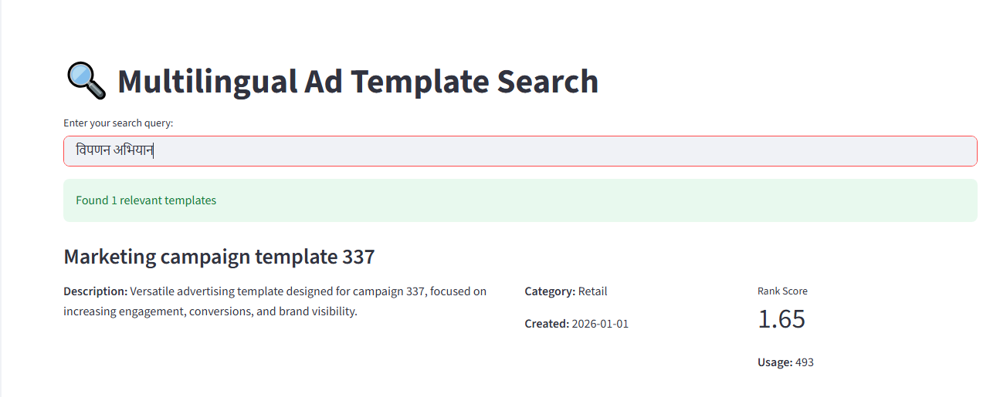

# 🔍 Multilingual Ad Template Search Engine

A full-stack semantic search application that allows users to find the most relevant ad templates using AI-powered multilingual embeddings.

## 🚀 Live Application
You can interact with the deployed Streamlit application here:

👉 **[https://kalpeshrajputmultilingualadtemplatesearch-txsdxca8flbg6pgul3fj.streamlit.app/](https://kalpeshrajputmultilingualadtemplatesearch-txsdxca8flbg6pgul3fj.streamlit.app/)**

## 🖼️ Test Use Case Screenshot
Below is a screenshot of the application in action, demonstrating a search for "**विपणन अभियान**" (Marketing Campaign in Hindi), which successfully retrieves a relevant English template.



## 💡 Features
- **Semantic Search**: Understands intent, not just keywords.
- **Multilingual**: Search in 50+ languages for English templates.
- **Smart Ranking**: Results are ranked by a combination of Semantic Similarity, Recency, and Popularity.
- **Fast Performance**: Uses FAISS for lightning-fast vector retrieval.

## 🛠️ Tech Stack
- **Backend**: FastAPI (Python)
- **Frontend**: Streamlit
- **Vector DB**: FAISS
- **AI Model**: `paraphrase-multilingual-MiniLM-L12-v2`
- **Environment**: `uv`

## 🚥 Quick Start

### 1. Prerequisites
Ensure you have `uv` installed (`pip install uv` or the official installer).

### 2. Install Dependencies
```bash
uv sync

run this command 
Terminal 1 : uv run uvicorn main:app --host 127.0.0.1 --port 8000 --reload
Terminal 2 : uv run streamlit run app.py
.
├── data/
│   ├── ad_faiss.index      # Pre-computed vector index
│   ├── ad_ids.npy          # Mapping of index to template IDs
│   └── ad_templates.json   # Full template metadata
├── main.py                 # FastAPI Backend
├── app.py                  # Streamlit Frontend
├── pyproject.toml          # Dependency definitions
└── README.md               # Project documentation

Terminal 1 : uv run uvicorn main:app --host 127.0.0.1 --port 8000 --reload
Terminal 2 : uv run streamlit run app.py

